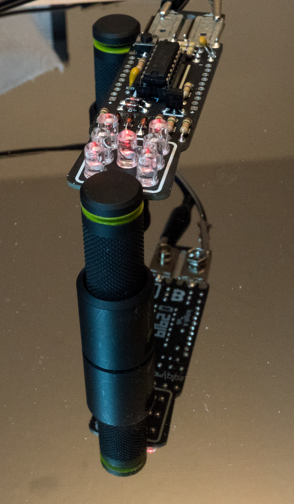

# p23-Pips

Build information around the Boldport Club project 23 - Pips -- a fancy die implementation using a 9V battery

## Bits & pieces

## Placing the through-hole parts

I'm starting by placing most of the through hole parts, essentially all which
can be fixated with solder from the top in their respective place. This means
all parts with the notable exception of the battery holder, the chip socket and
the LEDs. Since the footprints on the board are nicely matching up with the
size of the components one simply has to bend the legs close to the body to
make that happen -- as usual a great design by Saar.

## Fixating the placed parts

To ensure the parts don't move I'm soldering one leg of each from the top.

## De-legging

I wanted to go for the highly unprofessional but good locking dome soldering
style so I'm turning the board around and snipping away all legs, as close as
possible to the PCB.

## Doming

Now it's time to create the first set of shiny domes...

## Socket placing

To place the socket I'm simply sticking it in, turn the board around and snip
away one of the end pins and its diagonal counter part. Then, while carefully
putting my finger on it to keep it in place, I solder the two corner pins, trim
the rest of the legs and solder them, too.

## Soldering the LEDs

For the LEDs, I'm first placing all of them on the board (minding anode and
cathode!), then I put my hand on them and turn it around. Now I snip 1 leg of
each LED, put my finger on the LED to make sure it's flush with the board and
then solder the snipped leg; continuing my way through all of them. Then if
everything is verified to be nice looking I snip all the other legs and solder
them as well.

## Battery holder

Now the battery holder parts are going in on the solder side and fixated with
solder at the center tap, making sure they're reasonably flush. Then I turn the
board around and secure the sides of the poled with some more solder.

## Firing it up

And that's it. Now it just needs to be tested, cleaned and of course do the the
requested lucky roll...

